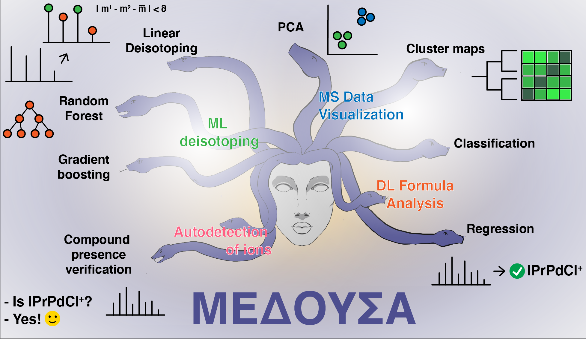

# MEDUSA

### Machine learning Enabled Deisotoping and Untargeted Spectra Analysis



Mass spectrometry (MS) is a convenient, highly sensitive, and reliable method for the analysis of complex mixtures,
which is vital for materials science, life sciences fields such as metabolomics and proteomics, and mechanistic research
in chemistry. Although it is one of the most powerful methods for individual compound detection, complete signal
assignment in complex mixtures is still a great challenge. The unconstrained formula-generating algorithm, covering the
entire spectra and revealing components, is a “dream tool” for researchers. We present the framework for efficient MS
data interpretation, describing a novel approach for detailed analysis based on deisotoping performed by
gradient-boosted decision trees and a neural network that generates molecular formulas from the fine isotopic structure,
approaching the long-standing inverse spectral problem. The workflow was successfully tested on three examples: fragment
ion analysis in protein sequencing for proteomics, analysis of the natural samples for life sciences, and study of the
cross-coupling catalytic system for chemistry.

[Follow us](http://ananikovlab.ru)

## How to use it?

To start with MEDUSA, first, install the required packages running. It is recommended to create new virtual environment
for this purpose.

```bash
pip install -r requirements.txt
```

If you want to build docs, you will also have to install Sphinx and furo theme, running

```bash
pip install sphinx
pip install furo
```

Then you will be able to

```bash
cd docs
make html
```

Built docs will be in the `_build` directory

### Simple operations with mass-spectra

To open a spectrum run

```python
from mass_automation.experiment import Experiment

exp = Experiment('spectrum.mzXML', n_scans=128, n_points=6)
```

Individual spectra can be accessed in list-like fashion

```python
spectrum = exp[0]
```

Masses and intensities can be accessed manually

```python
masses = spectrum.masses
ints = spectrum.ints
```

See more details on working with MEDUSA in documentation.

### Train element regression/classification models

To prepare training data do the following actions:

- Subsample PubChem using script `research/formula_generation/scripts/subsample_pubchem.py` and generate list of
  formulas (RDKit is required)
- Use `research/formula_generation/scripts/honest_subsampling.py` to subsample data from the formula list
- Generate isotopic distributions
  using `research/formula_generation/scripts/generate_fake_representation_multiprocess.py` of its single-process version
  by running `research/formula_generation/scripts/generate_fake_representation.py`. These scripts contain some
  parameters for the spectra generation, which were used in the current study. This may be altered to match your needs (
  e.g. lower resolution instrument).

The representations can then be used to train the models. Data, required to reproduce this work, is precalculated and is
provided in the `training_data.tsv.gz` file.

The neural network training code is presented in the `research/formula_generation/dl` directory. The pretrained model
can be loaded:

```python
from mass_automation.formula.model import LSTM

model = LSTM.load_from_checkpoint('pretrained_model.ckpt')
```

See examples on using the models in `research/formula_analysis_examples`.

### Train deisotoping models

To train your own model you have to create your own artificial spectra with `research/deisotoping/generate_mixtures.py`.
After that, you can create your own dataset for learning with `research/deisotoping/generate_dataset.py`. See examples on using the models in `research/deisotoping/MLDeisotoper_vs_LinearDeisotoper.ipynb`.

### Sample-oriented analysis

This analysis is useful to differentiate spectra and find similarities in them by applying unsupervised ML techniques. See examples on using the algorithms in `research/clustering_examples`.

### Compound presence verification

This algorithm is useful to find isotopic distribution of ion in spectrum with knowing molecular formula. See examples on using the algorithm in `research/compound_presence_verification`.

## Data requirements

### Deisotoping, compound presence verification, sample-oriented analysis

These algorithms are not rely on the fine isotopic structure thus can be performed on usual HRMS spectra.

### Element classification and element regression

These algorithms heavily rely on the fine isotopic structure, observable by using FT-ICR/MS and Orbitrap instruments.
The models can be retrained to match specific requirements of any type of the instruments. If fine isotopic structure is
not observable, some elements still can be recognised, but model prediction will be significantly complicated.

## Current development plan

- [ ] Publish MEDUSA on PyPI
- [ ] Add support for lower-resolution instruments
- [ ] Add support for MS/MS spectra

## Where is the data?

All used data is available on [MEGA](https://mega.nz/folder/vyAWgbrb#rO5lMqKdYe9dcOzIzHNQPQ). The tea dataset is currently used in the ongoing research project and can be provided upon request.

## How to cite it?

Boiko D.A., Kozlov K.S., Burykina J.V., Ilyushenkova V.V., Ananikov V.P., "Fully Automated Unconstrained Analysis of High-Resolution Mass Spectrometry Data with Machine Learning", *J. Am. Chem. Soc.*, **2022**, ASAP https://doi.org/10.1021/jacs.2c03631
